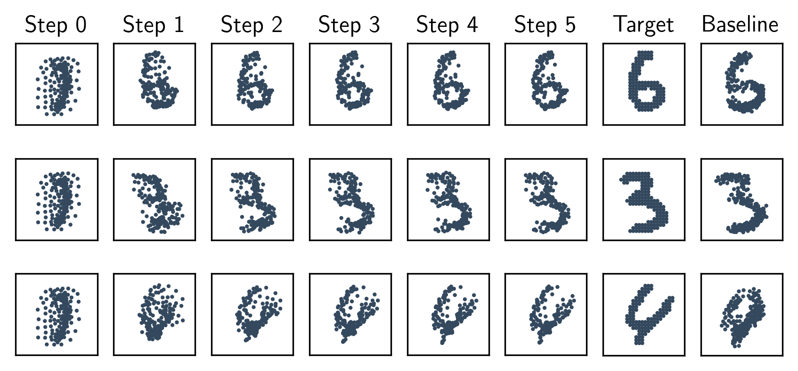

# Deep Set Prediction Networks



This is the official implementation of our NeurIPS 2019 paper [Deep Set Prediction Networks][0].
We propose a new way of predicting sets with a neural network that doesn't suffer from discontinuity issues.
This is done by backpropagating through a set encoder to act as a set decoder.
You can take a look at the [poster for NeurIPS 2019][4] or the [poster for the NeurIPS 2019 workshop on Sets & Partitions][5].

To use the decoder, you only need [`dspn.py`][1].
You can see how it is used in [`model.py`][2] with `build_net` and the `Net` class.
For details on the exact steps to reproduce the experiments, check out the README in the `dspn` directory.
You can download pre-trained models and the predictions thereof from the [Resources][3] page.

# BibTeX entry

```
@inproceedings{zhang2019dspn,
    author        = {Yan Zhang and Jonathon Hare and Adam Pr\"ugel-Bennett},
    title         = {{Deep Set Prediction Networks}},
    booktitle     = {Advances in Neural Information Processing Systems 32},
    year          = {2019},
    eprint        = {1906.06565},
    url           = {https://arxiv.org/abs/1906.06565},
}
```


[0]: https://arxiv.org/abs/1906.06565
[1]: https://github.com/Cyanogenoid/dspn/blob/master/dspn.py
[2]: https://github.com/Cyanogenoid/dspn/blob/master/dspn/model.py
[3]: https://github.com/Cyanogenoid/dspn/releases/tag/resources
[4]: https://www.cyanogenoid.com/files/dspn-poster.pdf
[5]: https://www.cyanogenoid.com/files/dspn-workshop-poster.pdf
